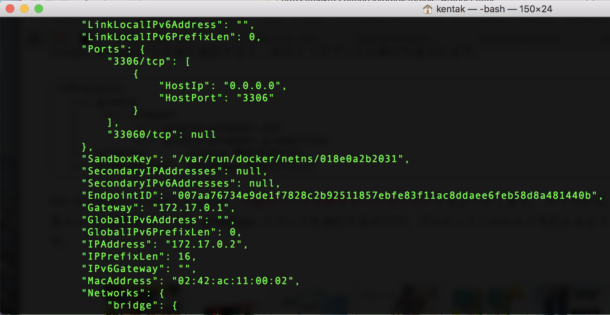

# Microservices Sample

## Description
MySQLのsakilaサンプルを利用して作成したAPIです。

## Film一覧取得API
* http://${WildFlyのIP}:8080/ms/api/sakila/films
    * 登録されているすべての映画を取得
    * 戻り値
    ```json
    {
        "description": "A Emotional Tale of a Pastry Chef And a Forensic Psychologist who must Succumb a Monkey in The Sahara Desert",
        "filmCategory": {
            "category": {
                "categoryId": 5,
                "lastUpdate": "2006-02-14T19:46:27Z[UTC]",
                "name": "Comedy"
            },
            "id": {
                "categoryId": 5,
                "filmId": 247
            },
            "lastUpdate": "2006-02-14T20:07:09Z[UTC]"
        },
        "filmId": 247,
        "language": {
            "languageId": 1,
            "lastUpdate": "2006-02-14T20:02:19Z[UTC]",
            "name": "English"
        },
        "lastUpdate": "2006-02-14T20:03:42Z[UTC]",
        "length": 47,
        "rating": "G",
        "releaseYear": "2006-01-01",
        "rentalDuration": 3,
        "rentalRate": 0.99,
        "replacementCost": 19.99,
        "specialFeatures": "Trailers,Commentaries,Deleted Scenes",
        "title": "DOWNHILL ENOUGH"
    },
    {
      //略
    }
  
    ```
* http://${WildFlyのIP}:8080/ms/api/sakila/film/<映画名>
    * 登録されている映画から映画名で検索した結果を取得
* http://${WildFlyのIP}:8080/ms/api/sakila/<id>
    * 登録されている映画からfilm_idで映画を検索

## 準備
### 本アプリケーションのダウンロードとビルド
※ gitを利用します。
1. git cloneコマンドを利用して本プロジェクトをクローンします。
    ```
    git clone https://github.com/k-kosugi/microservices.git
    ```
1. gradleを利用してビルドします。
    ```
    gradlew build
    ```
    * Gradle Wrapperを使用しているので、必要に応じてgradleがダウンロードされます。
    * 詳しくは[Gradle Wrapperとは](http://gradle.monochromeroad.com/docs/userguide/gradle_wrapper.html)を参照ください。
1. build/libsディレクトリにwarファイルが作成されます。
1. warファイルをWildFlyにデプロイします。※ WildFlyのインストールとデータソースの登録が終わってから
    * 将来的にはDockerfileを記述して自動デプロイするようにします。
    * ${WILDFLY}/standalone/depoyディレクトリにwarファイルを放り込むことでデプロイ可能です。

### MySQL
※ docker for Macを利用します。
1. docker volumeを作成します。
    ```
    $ docker volume create mysql_volume
    ```
1. docker/mysqlディレクトリに移動し以下のコマンドを利用して、dockerイメージを作成します。
    ```
    $ docker build . -t netapp/mysql:v1
    ```
1. 作成したイメージを利用してMySQLをdockerで起動します。
    ```
    $ docker run -d --name mymysql -p 3306:3306 -v mysql_volume:/var/lib/mysql netapp/mysql:v1
    ```
1. docker inspectコマンドを利用してIPを調査します。
    ```
    $ docker inspect mymysql
    ```
    
1. docker execコマンドを利用してsakilaデータベースが作成されていることを確認します。
    ```
    $ docker exec -it mymysql /bin/bash
    root@437e24fc8326:/# mysql -u root -p
    Enter password: <--ontapを入力
    Welcome to the MySQL monitor.  Commands end with ; or \g.
    Your MySQL connection id is 11
    Server version: 8.0.15 MySQL Community Server - GPL
    
    Copyright (c) 2000, 2019, Oracle and/or its affiliates. All rights reserved.
    
    Oracle is a registered trademark of Oracle Corporation and/or its
    affiliates. Other names may be trademarks of their respective
    owners.
    
    Type 'help;' or '\h' for help. Type '\c' to clear the current input statement.
    
    mysql> select count(*) from sakila.film;
    +----------+
    | count(*) |
    +----------+
    |     1000 |
    +----------+
    1 row in set (0.01 sec)
    ```
### Wildfly
1. WildFly15.0をダウンロードします。
1. WildFlyにユーザーを登録します。
    ```
    ${WILDFLY}/bin/add-user.sh <ユーザー名> <パスワード> --silent
    ```
1. WildFlyをバックグラウンドで起動します。
    ```
    ${WILDFLY}/bin/standalone.sh -b 0.0.0.0 -bmanagement 0.0.0.0 &
    ```
1. 以下のコマンドを入力してデータソースを登録します。<br/>{MYSQL}の箇所をMySQLの起動しているdockerのIPアドレスに変更します。
    ```
    ${WILDFLY}/bin/jboss-cli.sh --connect << EOF
    data-source add \
        --name=MySqlDS \
        --jndi-name=java:/MySqlDS \
        --driver-name=mysql-connector-java-8.0.15.jar \
        --driver-class=com.mysql.cj.jdbc.Driver \
        --connection-url=jdbc:mysql://{MYSQL}:3306/sakila \
        --user-name=netapp \
        --password=ontap
    EOF
    ```
### WildFlyの停止
1. WildFlyを停止します。
    ```
    $ ${WILDFLY}/bin/jboss-cli.sh --connect --command=":shutdown"
    ```
  
## 利用技術
利用技術は以下の通りとなっています。

- git/github
- gradle
    - Java EEアプリケーション(warファイル)のビルド・テスト・パッケージング
    - Mavenリポジトリからのライブラリ自動ダウンロード
- Java EE8 - WildFlyを想定
    - JAX-RS(RESTEasy - WildFly)
    - JAXB(オブジェクトをJSON化する際に裏で利用)
    - JPA(EclipseLink)
    - [予定]Swagger for RESTEasy
- docker for Mac
    - MySQL - Dockerfileを利用してビルド。[sakila](https://dev.mysql.com/doc/sakila/en/)サンプルを初期イメージ作成時に作成する。
    - WildFly - Dockerfileを利用してビルド予定。